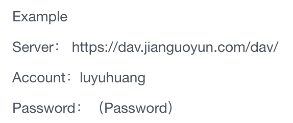
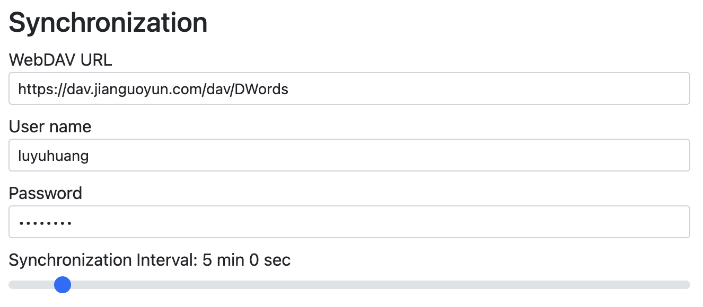

# DWords

Show words as Danmaku on the screen to help you memorize them.

把单词变成屏幕上的弹幕来帮助你记住它们.

[][release]
[][release]

**Download from the [release page][release] | 到[发布页][release]下载**

[release]: https://github.com/luyuhuang/DWords2/releases/latest

## Introduction

DWords is a desktop application that displays words as Danmaku (floating scroll messages) on your screen. This will repeat words in front of you over and over again to help you memorize them when using the computer. DWords is developed using [Electron][electron] + [Vue][vue] + [Bootstrap][bootstrap] and supports both Windows and macOS.

DWords 是一个桌面应用, 它将单词以弹幕的形式显示在屏幕上. 这将一遍又一遍地在你眼前重复展示单词来帮助你在使用电脑的过程中记住他们. DWords 使用 [Electron][electron] + [Vue][vue] + [Bootstrap][bootstrap] 开发, 同时支持 Windows 和 macOS.

[electron]: https://www.electronjs.org/
[vue]: https://vuejs.org/
[bootstrap]: https://getbootstrap.com/

Main Features:

- [x] Show words as Danmaku | 把单词显示成弹幕
- [x] Word memorization plan | 背单词计划
- [x] Build-in dictionaries and libraries | 内置词典和词库
- [x] Synchronize via WebDAV | 通过 WebDAV 同步
- [x] Support word search | 支持查词
- [ ] Statistics | 学习统计
- [ ] Review according to the forgetting curve | 根据艾宾浩斯遗忘曲线复习

## Synchronization

DWords supports synchronization. We can synchronize words and learning states between devices via any cloud service that supports WebDAV.

DWords 支持同步. 我们可以通过任何支持 WebDAV 的云服务在不同设备之间同步单词和学习记录.

If your cloud drive supports WebDAV, a WebDAV URL usually could be found on its settings page.

如果你的云盘支持 WebDAV, 通常可以在其设置页面上找到 WebDAV URL.

That URL usually represents the root directory of your cloud drive. You can create a folder named `DWords`, then open DWords' settings interface and set the WebDAV URL as the root URL plus the folder name. Don't forget to enter the corresponding username and password.

这个 URL 通常代表云盘的根目录. 你可以创建一个名为 `DWords` 的文件夹, 然后打开 DWords 的设置界面, 将 WebDAV URL 设置成根 URL + 文件夹名. 别忘了输入相应的用户名和密码.

